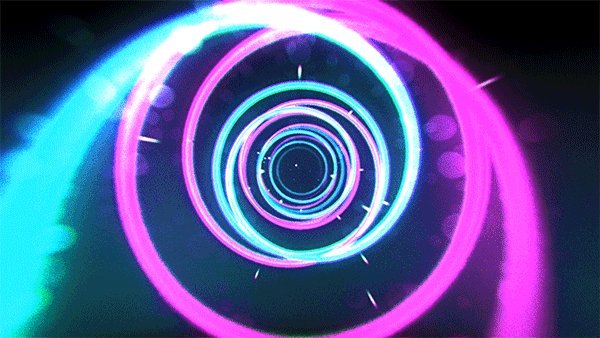

<h1 align="center"><a href="https://github.com/vartexxx" target="_blank" style="background: -webkit-linear-gradient(0deg, #ff07fe 0%, #48abe0 100%);
-webkit-background-clip: text;
-webkit-text-fill-color: transparent;">𝕍𝕝𝕒𝕕𝕚𝕤𝕝𝕒𝕧</a>
</h1>
<h2 align="center" style="background: -webkit-linear-gradient(0deg, #ff0056 0%, #48abe0 100%);
-webkit-background-clip: text;
-webkit-text-fill-color: transparent; font-size: 40px;">🄵🅄🄻🄻🅂🅃🄰🄲🄺-🄳🄴🅅🄴🄻🄾🄿🄴🅁</h2>

#

𝕄𝕪 𝕔𝕠𝕕𝕖𝕨𝕒𝕣𝕤 𝕤𝕥𝕒𝕥𝕖

#
